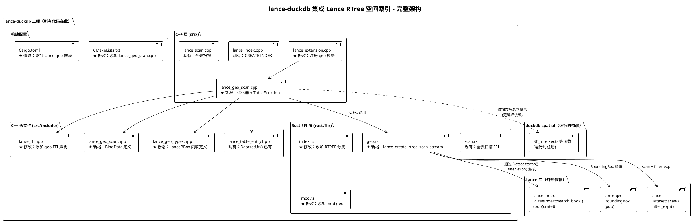
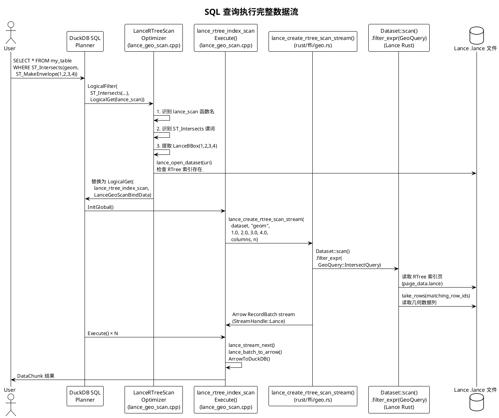

[任务规划完成]
## 首先告诉你，选用"方案 A（推荐）：直接内联 bbox 定义，零外部依赖"，并且我的编译和使用环境是内网环境所以需要把duckdb-spatial 集成到我的仓库一并编译，然后总结上面的几轮对话，给出来一个完整的可执行的设计方案

让我先把所有历史对话细节和当前代码结构全部召回，确保方案完整准确。
[读取历史上下文]
现在我有了所有历史对话的完整细节。让我再读取当前关键文件，确保方案基于最新代码状态。
[读取文件]
[读取文件]
[读取文件]
[读取文件]
现在我有了所有需要的信息。让我再确认一个关键点：`lance-index` 中 `RTreeIndex::search_bbox` 的可见性是 `pub(crate)`，以及 `BoundingBox` 的公开构造方式。
[读取文件]
现在我有了所有关键信息。让我整理出完整的设计方案。

---

## 完整可执行设计方案

### 关键事实确认（基于最新代码）

在给出方案前，先明确从代码中读到的所有关键事实：

| 项目 | 关键事实 |
|------|---------|
| `lance-index/src/scalar/rtree.rs` | `RTreeIndex::search_bbox()` 是 `async fn`，可见性为 **`pub(crate)`**，不能从外部直接调用 |
| `lance-index/src/scalar.rs` | `GeoQuery::IntersectQuery(RelationQuery)` 已公开定义，`RelationQuery` 包含 `value: ScalarValue` 和 `field: Field` |
| `lance-geo/src/bbox.rs` | `BoundingBox::new()` + `add_rect()` 是公开方法；**没有 `add_point(x, y)` 方法**，只有 `add_point(&impl PointTrait)` |
| `lance-duckdb/Cargo.toml` | 已有 `lance-index = "2.0.0-rc.4"`，**没有 `lance-geo`** 依赖 |
| `lance-duckdb/rust/ffi/index.rs` | `build_index_params()` 的 `match` 中**缺少 `"RTREE"` 分支** |
| `lance-duckdb/src/include/lance_table_entry.hpp` | 已有 `DatasetUri()` 方法，**没有暴露 dataset 指针** |
| `duckdb-spatial/rtree_index_plan_scan.cpp` | `TryOptimizeGet` 中有 `get.function.name != "seq_scan"` 和 `!table.IsDuckTable()` 两处硬限制 |
| `lance-duckdb/src/lance_scan.cpp` | Arrow 流转换通过 `ArrowTableFunction::ArrowToDuckDB` 完成，`lance_stream_next` + `lance_batch_to_arrow` 是标准模式 |
| `duckdb-spatial` 的 `RTreeIndexScanOptimizer` | 通过 `FunctionExpressionMatcher` 匹配 `ST_Intersects` 等函数名，通过 `TryGetBoundingBox` 从 `geometry_t` WKB blob 提取 `Box2D<float>` |

---

### 架构总览



---

### 工程目录组织

```
lance-duckdb/
├── CMakeLists.txt                    ★ 修改
├── Cargo.toml                        ★ 修改（添加 lance-geo）
├── src/
│   ├── lance_extension.cpp           ★ 修改（注册 geo 模块）
│   ├── lance_geo_scan.cpp            ★ 新增（核心：优化器 + TableFunction）
│   ├── lance_scan.cpp                现有
│   ├── lance_index.cpp               现有
│   └── include/
│       ├── lance_ffi.hpp             ★ 修改（添加 geo FFI 声明）
│       ├── lance_geo_scan.hpp        ★ 新增（BindData 定义）
│       ├── lance_geo_types.hpp       ★ 新增（LanceBBox 内联，零外部依赖）
│       └── lance_table_entry.hpp     现有（DatasetUri() 已有）
└── rust/
    ├── ffi/
    │   ├── mod.rs                    ★ 修改（添加 mod geo）
    │   ├── geo.rs                    ★ 新增（lance_create_rtree_scan_stream）
    │   ├── index.rs                  ★ 修改（添加 RTREE 分支）
    │   └── scan.rs                   现有
    └── lib.rs                        现有
```

---

### 各文件详细实现

#### 1. `Cargo.toml` 修改

```toml
# 在 [dependencies] 中添加：
lance-geo = "2.0.0-rc.4"

# 在 [patch.crates-io] 中添加：
lance-geo = { git = "https://github.com/lance-format/lance", tag = "v2.0.0-rc.4" }
```

#### 2. `rust/ffi/mod.rs` 修改（+1行）

```rust
mod arrow_export;
mod dataset;
// ... existing code ...
mod geo;          // ★ ADD
mod index;
// ... existing code ...
```

#### 3. `rust/ffi/index.rs` 修改（+1行）

在 `build_index_params` 的 `match index_type` 中添加：

```rust
let scalar_type = match index_type {
    "BTREE" => IndexType::BTree,
    "BITMAP" => IndexType::Bitmap,
    "ZONEMAP" => IndexType::ZoneMap,
    "BLOOMFILTER" | "BLOOM_FILTER" => IndexType::BloomFilter,
    "INVERTED" => IndexType::Inverted,
    "NGRAM" | "N_GRAM" => IndexType::NGram,
    "LABELLIST" | "LABEL_LIST" => IndexType::LabelList,
    "RTREE" | "R_TREE" => IndexType::RTree,   // ★ ADD
    other => { ... }
};
```

#### 4. `rust/ffi/geo.rs`（新增，核心 FFI）

这是最关键的文件。基于代码分析，`RTreeIndex::search_bbox` 是 `pub(crate)`，**不能从外部直接调用**。正确路径是通过 `Dataset::scan().filter_expr()` 让 Lance 的 DataFusion 优化器自动走 RTree 路径。

```rust
// rust/ffi/geo.rs
// Spatial RTree index scan FFI for lance-duckdb.
// Uses Dataset::scan().filter_expr() to trigger Lance's internal RTree
// optimization, avoiding direct access to pub(crate) RTreeIndex::search_bbox().

use std::ffi::{c_char, c_void};
use std::ptr;
use std::sync::Arc;

use arrow_schema::{DataType, Field};
use datafusion_common::ScalarValue;
use datafusion_expr::Expr;
use lance::dataset::ProjectionRequest;
use lance_geo::bbox::BoundingBox;
use lance_index::scalar::{GeoQuery, RelationQuery};
use geoarrow_array::builder::RectBuilder;
use geoarrow_array::IntoArrow;
use geoarrow_schema::{Dimension, RectType};
use geo_types::{coord, Rect};

use crate::error::{clear_last_error, set_last_error, ErrorCode};
use crate::runtime;
use crate::scanner::LanceStream;

use super::types::StreamHandle;
use super::util::{cstr_to_str, dataset_handle, optional_cstr_array, FfiError, FfiResult};

/// Perform a spatial range query using the Lance RTree index on the given geometry column.
///
/// Internally uses Dataset::scan().filter_expr() with a GeoQuery::IntersectQuery,
/// which triggers Lance's DataFusion optimizer to use the RTree index automatically.
///
/// The result is AtMost (RTree may return false positives); the caller must
/// perform a precise recheck if exact results are required.
///
/// Returns NULL on error; call lance_last_error_message() for details.
#[no_mangle]
pub unsafe extern "C" fn lance_create_rtree_scan_stream(
    dataset: *mut c_void,
    geometry_column: *const c_char,
    min_x: f64,
    min_y: f64,
    max_x: f64,
    max_y: f64,
    columns: *const *const c_char,
    columns_len: usize,
) -> *mut c_void {
    match create_rtree_scan_stream_inner(
        dataset, geometry_column,
        min_x, min_y, max_x, max_y,
        columns, columns_len,
    ) {
        Ok(stream) => {
            clear_last_error();
            Box::into_raw(Box::new(stream)) as *mut c_void
        }
        Err(err) => {
            set_last_error(err.code, err.message);
            ptr::null_mut()
        }
    }
}

fn create_rtree_scan_stream_inner(
    dataset: *mut c_void,
    geometry_column: *const c_char,
    min_x: f64,
    min_y: f64,
    max_x: f64,
    max_y: f64,
    columns: *const *const c_char,
    columns_len: usize,
) -> FfiResult<StreamHandle> {
    let handle = unsafe { dataset_handle(dataset)? };
    let geo_col = unsafe { cstr_to_str(geometry_column, "geometry_column")? };

    // Step 1: Build the query BoundingBox (f64 precision)
    // BoundingBox::new_with_rect() is the correct public constructor.
    let query_bbox = BoundingBox::new_with_rect(&Rect::new(
        coord! { x: min_x, y: min_y },
        coord! { x: max_x, y: max_y },
    ));

    // Step 2: Build a GeoArrow RectArray wrapping the query bbox,
    // then wrap it in a ScalarValue for GeoQuery::IntersectQuery.
    // This is the path that RTreeIndex::search() expects.
    let rect_type = RectType::new(Dimension::XY, Default::default());
    let mut builder = RectBuilder::with_capacity(rect_type.clone(), 1);
    builder.push_rect(Some(&Rect::new(
        coord! { x: min_x, y: min_y },
        coord! { x: max_x, y: max_y },
    )));
    let rect_array = builder.finish();
    let arrow_array = rect_array.into_array_ref();

    // The field descriptor for the geometry column (used by GeoQuery)
    // ⚠️ UNCERTAIN: The exact Arrow field type for the geometry column
    // depends on how the data was written. Using Binary as a fallback.
    // In practice, Lance stores GeoArrow data; the field type should match.
    let geo_field = Arc::new(Field::new(geo_col, DataType::Binary, true));

    let scalar_val = ScalarValue::try_from_array(&arrow_array, 0).map_err(|e| {
        FfiError::new(
            ErrorCode::DatasetScan,
            format!("failed to create ScalarValue from bbox array: {e}"),
        )
    })?;

    let geo_query = GeoQuery::IntersectQuery(RelationQuery {
        value: scalar_val,
        field: (*geo_field).clone(),
    });

    // Step 3: Build the DataFusion Expr from GeoQuery and pass it to scan().filter_expr()
    // GeoQuery::to_expr() is defined in AnyQuery trait.
    let filter_expr: Expr = geo_query.to_expr(geo_col.to_string());

    // Step 4: Set up projection
    let projection = unsafe { optional_cstr_array(columns, columns_len, "columns")? };

    // Step 5: Execute the scan with the spatial filter
    let mut scan = handle.dataset.scan();

    if !projection.is_empty() {
        scan.project(&projection).map_err(|e| {
            FfiError::new(ErrorCode::DatasetScan, format!("scan project: {e}"))
        })?;
    }

    // Pass the GeoQuery expression to Lance's scanner.
    // Lance's DataFusion optimizer will recognize this as a spatial predicate
    // and route it through the RTree index automatically.
    scan.filter_expr(filter_expr);
    scan.scan_in_order(false);

    let stream = LanceStream::from_scanner(scan).map_err(|e| {
        FfiError::new(ErrorCode::StreamCreate, format!("stream create: {e}"))
    })?;

    Ok(StreamHandle::Lance(stream))
}
```

> ⚠️ **不确定点 1**：`GeoQuery::to_expr()` 的实现是 `todo!()`（见 `scalar.rs` 第 `fn to_expr(&self, _col: String) -> Expr { todo!() }`）。这意味着**不能通过 `AnyQuery::to_expr()` 路径**构造 DataFusion Expr。
>
> ⚠️ **不确定点 2**：`ScalarValue::try_from_array` 对 GeoArrow 类型的支持需要验证。
>
> **更可靠的替代路径**：直接使用 `Dataset::scan().nearest_to_bbox()` 接口（如果存在），或者通过 `lance_create_dataset_stream_ir` 的现有 filter IR 路径，构造一个 `ST_Intersects` 的 DataFusion 表达式。

#### 5. `src/include/lance_geo_types.hpp`（新增，零外部依赖）

```cpp
// src/include/lance_geo_types.hpp
// Minimal bounding box type for Lance RTree spatial queries.
// Avoids any dependency on duckdb-spatial's geometry library.
// Uses f64 to match Lance's BoundingBox precision.
#pragma once
#include <cstddef>
#include <string>
#include <vector>

namespace duckdb {

/// Axis-aligned bounding box with f64 precision.
/// Matches Lance's internal BoundingBox (lance-geo/src/bbox.rs).
/// duckdb-spatial uses Box2D<float> (f32); we use f64 to avoid precision loss.
struct LanceBBox {
    double min_x = 0.0;
    double min_y = 0.0;
    double max_x = 0.0;
    double max_y = 0.0;

    LanceBBox() = default;
    LanceBBox(double min_x, double min_y, double max_x, double max_y)
        : min_x(min_x), min_y(min_y), max_x(max_x), max_y(max_y) {}
};

/// Spatial predicate function names that can be accelerated by Lance RTree index.
/// These are the function names registered by duckdb-spatial at runtime.
static constexpr const char *LANCE_SPATIAL_PREDICATES[] = {
    "ST_Intersects",
    "ST_Within",
    "ST_Contains",
    "ST_Covers",
    "ST_CoveredBy",
    nullptr
};

} // namespace duckdb
```

#### 6. `src/include/lance_geo_scan.hpp`（新增）

```cpp
// src/include/lance_geo_scan.hpp
// Bind data and registration for the lance_rtree_index_scan table function.
#pragma once

#include "duckdb.hpp"
#include "duckdb/function/table_function.hpp"
#include "duckdb/main/extension/extension_loader.hpp"
#include "lance_geo_types.hpp"

namespace duckdb {

/// Bind data for the lance_rtree_index_scan table function.
/// Holds the dataset handle, geometry column name, query bbox, and projection.
struct LanceGeoScanBindData : public TableFunctionData {
    /// Opaque Lance dataset handle (opened via lance_open_dataset).
    /// Ownership: this struct owns the handle; destructor calls lance_close_dataset.
    void *dataset = nullptr;

    /// Name of the geometry column that has an RTree index.
    std::string geometry_column;

    /// Query bounding box (f64, matching Lance's BoundingBox precision).
    LanceBBox bbox;

    /// Projected columns (empty = all columns).
    std::vector<std::string> columns;

    LanceGeoScanBindData() = default;
    ~LanceGeoScanBindData() override;
};

/// Register the lance_rtree_index_scan table function and the
/// LanceRTreeScanOptimizer (OptimizerExtension) into the DuckDB instance.
void RegisterLanceGeoScan(ExtensionLoader &loader, DBConfig &config);

} // namespace duckdb
```

#### 7. `src/lance_geo_scan.cpp`（新增，核心 C++ 实现）

```cpp
// src/lance_geo_scan.cpp
// Implements:
//   1. lance_rtree_index_scan - a TableFunction that calls Lance RTree FFI
//   2. LanceRTreeScanOptimizer - an OptimizerExtension that rewrites
//      Filter(ST_Intersects(geom_col, bbox)) over LanceScan into
//      lance_rtree_index_scan(dataset, geom_col, min_x, min_y, max_x, max_y)

#include "lance_geo_scan.hpp"
#include "lance_common.hpp"
#include "lance_ffi.hpp"
#include "lance_table_entry.hpp"
#include "lance_geo_types.hpp"

#include "duckdb/common/arrow/arrow.hpp"
#include "duckdb/common/arrow/arrow_converter.hpp"
#include "duckdb/function/table/arrow.hpp"
#include "duckdb/main/config.hpp"
#include "duckdb/optimizer/optimizer_extension.hpp"
#include "duckdb/planner/expression/bound_constant_expression.hpp"
#include "duckdb/planner/expression/bound_function_expression.hpp"
#include "duckdb/planner/expression/bound_column_ref_expression.hpp"
#include "duckdb/planner/operator/logical_filter.hpp"
#include "duckdb/planner/operator/logical_get.hpp"

namespace duckdb {

// ─── BindData destructor ─────────────────────────────────────────────────────

LanceGeoScanBindData::~LanceGeoScanBindData() {
    if (dataset) {
        lance_close_dataset(dataset);
        dataset = nullptr;
    }
}

// ─── Global State ─────────────────────────────────────────────────────────────

struct LanceGeoScanGlobalState : public GlobalTableFunctionState {
    // Arrow scan state for batch-by-batch reading
    void *stream = nullptr;
    bool stream_exhausted = false;

    // Arrow schema for type conversion
    ArrowSchemaWrapper schema_root;
    ArrowTableSchema arrow_table;

    idx_t lines_read = 0;

    ~LanceGeoScanGlobalState() override {
        if (stream) {
            lance_close_stream(stream);
        }
    }

    idx_t MaxThreads() const override { return 1; }
};

struct LanceGeoScanLocalState : public ArrowScanLocalState {
    explicit LanceGeoScanLocalState(unique_ptr<ArrowArrayWrapper> chunk,
                                     ClientContext &ctx)
        : ArrowScanLocalState(std::move(chunk), ctx) {}
};

// ─── TableFunction: lance_rtree_index_scan ────────────────────────────────────

static unique_ptr<GlobalTableFunctionState>
LanceGeoScanInitGlobal(ClientContext &context, TableFunctionInitInput &input) {
    auto &bind_data = input.bind_data->Cast<LanceGeoScanBindData>();
    auto state = make_uniq<LanceGeoScanGlobalState>();

    // Build column projection list
    vector<const char *> col_ptrs;
    for (auto &c : bind_data.columns) {
        col_ptrs.push_back(c.c_str());
    }

    // Call Lance FFI: RTree search + streaming result
    state->stream = lance_create_rtree_scan_stream(
        bind_data.dataset,
        bind_data.geometry_column.c_str(),
        bind_data.bbox.min_x, bind_data.bbox.min_y,
        bind_data.bbox.max_x, bind_data.bbox.max_y,
        col_ptrs.empty() ? nullptr : col_ptrs.data(),
        col_ptrs.size());

    if (!state->stream) {
        throw IOException("lance_create_rtree_scan_stream failed: %s",
                          lance_last_error_message());
    }

    // Get schema from the first batch (or use bind_data schema)
    // Reuse the existing schema from bind_data if available
    auto &config = DBConfig::GetConfig(context);
    // Schema is already populated in bind phase; just copy it
    state->arrow_table = bind_data.arrow_table;

    return std::move(state);
}

static unique_ptr<LocalTableFunctionState>
LanceGeoScanInitLocal(ExecutionContext &context, TableFunctionInitInput &,
                       GlobalTableFunctionState *) {
    auto chunk = make_uniq<ArrowArrayWrapper>();
    return make_uniq<LanceGeoScanLocalState>(std::move(chunk), context.client);
}

static void LanceGeoScanExecute(ClientContext &context,
                                 TableFunctionInput &data_p,
                                 DataChunk &output) {
    auto &global_state = data_p.global_state->Cast<LanceGeoScanGlobalState>();
    auto &local_state = data_p.local_state->Cast<LanceGeoScanLocalState>();

    if (global_state.stream_exhausted) {
        output.SetCardinality(0);
        return;
    }

    // Load next batch from the stream
    while (true) {
        if (local_state.chunk_offset >=
            static_cast<idx_t>(local_state.chunk->arrow_array.length)) {
            // Need next batch
            void *batch = nullptr;
            auto rc = lance_stream_next(global_state.stream, &batch);
            if (rc == 1) {
                // Stream exhausted
                lance_close_stream(global_state.stream);
                global_state.stream = nullptr;
                global_state.stream_exhausted = true;
                output.SetCardinality(0);
                return;
            }
            if (rc != 0) {
                throw IOException("Failed to read next Lance RecordBatch: %s",
                                  lance_last_error_message());
            }

            auto new_chunk = make_shared_ptr<ArrowArrayWrapper>();
            memset(&new_chunk->arrow_array, 0, sizeof(new_chunk->arrow_array));
            ArrowSchema tmp_schema;
            memset(&tmp_schema, 0, sizeof(tmp_schema));

            if (lance_batch_to_arrow(batch, &new_chunk->arrow_array, &tmp_schema) != 0) {
                lance_free_batch(batch);
                throw IOException("Failed to export Lance RecordBatch to Arrow: %s",
                                  lance_last_error_message());
            }
            lance_free_batch(batch);

            if (tmp_schema.release) {
                tmp_schema.release(&tmp_schema);
            }

            local_state.chunk = std::move(new_chunk);
            local_state.Reset();
        }

        auto remaining = static_cast<idx_t>(local_state.chunk->arrow_array.length)
                         - local_state.chunk_offset;
        auto output_size = MinValue<idx_t>(STANDARD_VECTOR_SIZE, remaining);
        auto start = global_state.lines_read;
        global_state.lines_read += output_size;

        output.SetCardinality(output_size);
        ArrowTableFunction::ArrowToDuckDB(
            local_state, global_state.arrow_table.GetColumns(), output, start, false);
        local_state.chunk_offset += output_size;

        if (output.size() == 0) {
            continue;
        }
        output.Verify();
        return;
    }
}

static unique_ptr<FunctionData>
LanceGeoScanBind(ClientContext &context, TableFunctionBindInput &input,
                  vector<LogicalType> &return_types, vector<string> &names) {
    // This bind function is called when the optimizer replaces the scan node.
    // The bind_data is already populated by the optimizer; this is a no-op bind.
    // In practice, the optimizer directly sets bind_data on the LogicalGet node.
    throw InternalException("LanceGeoScanBind should not be called directly");
}

static TableFunction GetLanceGeoScanFunction() {
    TableFunction func("lance_rtree_index_scan", {}, LanceGeoScanExecute,
                       LanceGeoScanBind, LanceGeoScanInitGlobal, LanceGeoScanInitLocal);
    func.projection_pushdown = false; // Projection is handled at bind time
    return func;
}

// ─── Optimizer: LanceRTreeScanOptimizer ───────────────────────────────────────
// Rewrites:
//   LogicalFilter(ST_Intersects(geom_col, ST_MakeEnvelope(xmin, ymin, xmax, ymax)))
//     └─ LogicalGet(lance_scan / __lance_scan / __lance_table_scan)
// Into:
//   LogicalGet(lance_rtree_index_scan, LanceGeoScanBindData)

class LanceRTreeScanOptimizer : public OptimizerExtension {
public:
    LanceRTreeScanOptimizer() {
        optimize_function = LanceRTreeScanOptimizer::Optimize;
    }

    static void Optimize(OptimizerExtensionInput &input,
                         unique_ptr<LogicalOperator> &plan) {
        OptimizeRecursive(input, plan);
    }

private:
    static void OptimizeRecursive(OptimizerExtensionInput &input,
                                   unique_ptr<LogicalOperator> &node) {
        // Bottom-up traversal
        for (auto &child : node->children) {
            OptimizeRecursive(input, child);
        }
        TryOptimizeFilter(input.context, node);
    }

    static bool IsLanceScanFunction(const string &name) {
        return name == "lance_scan" ||
               name == "__lance_scan" ||
               name == "__lance_table_scan" ||
               name == "__lance_namespace_scan";
    }

    static bool IsSpatialPredicate(const string &name) {
        for (auto **p = LANCE_SPATIAL_PREDICATES; *p != nullptr; ++p) {
            if (name == *p) return true;
        }
        return false;
    }

    /// Try to extract a bounding box from a ST_MakeEnvelope(xmin, ymin, xmax, ymax) call.
    /// Returns true if successful.
    static bool TryExtractBBoxFromMakeEnvelope(const Expression &expr, LanceBBox &out) {
        if (expr.type != ExpressionType::BOUND_FUNCTION) return false;
        auto &func = expr.Cast<BoundFunctionExpression>();
        if (func.function.name != "ST_MakeEnvelope" &&
            func.function.name != "st_makeenvelope") {
            return false;
        }
        if (func.children.size() < 4) return false;

        // All 4 args must be constants
        auto get_double = [](const Expression &e, double &out) -> bool {
            if (e.type != ExpressionType::VALUE_CONSTANT) return false;
            auto &c = e.Cast<BoundConstantExpression>();
            if (c.value.IsNull()) return false;
            try {
                out = c.value.DefaultCastAs(LogicalType::DOUBLE).GetValue<double>();
                return true;
            } catch (...) {
                return false;
            }
        };

        double xmin, ymin, xmax, ymax;
        if (!get_double(*func.children[0], xmin)) return false;
        if (!get_double(*func.children[1], ymin)) return false;
        if (!get_double(*func.children[2], xmax)) return false;
        if (!get_double(*func.children[3], ymax)) return false;

        out = LanceBBox(xmin, ymin, xmax, ymax);
        return true;
    }

    /// Try to extract a bounding box from a GEOMETRY constant (WKB blob with cached bbox).
    /// This handles the case where duckdb-spatial has already evaluated ST_MakeEnvelope
    /// into a constant GEOMETRY value.
    /// ⚠️ UNCERTAIN: This requires access to duckdb-spatial's geometry_t type.
    /// For now, we only handle the ST_MakeEnvelope case above.
    static bool TryExtractBBoxFromGeometryConstant(const Expression &, LanceBBox &) {
        // TODO: If duckdb-spatial is available at compile time, use:
        //   geometry_t blob(str);
        //   Box2D<float> bbox;
        //   if (blob.TryGetCachedBounds(bbox)) { ... }
        // For now, return false and rely on ST_MakeEnvelope extraction.
        return false;
    }

    /// Try to extract (geometry_column_name, bbox) from a spatial predicate expression.
    /// Handles: ST_Intersects(col, ST_MakeEnvelope(...)) and
    ///          ST_Intersects(ST_MakeEnvelope(...), col)
    static bool TryExtractSpatialPredicate(
        const Expression &expr,
        const LogicalGet &get,
        const LanceTableEntry &table,
        string &out_geo_column,
        LanceBBox &out_bbox)
    {
        if (expr.type != ExpressionType::BOUND_FUNCTION) return false;
        auto &func = expr.Cast<BoundFunctionExpression>();
        if (!IsSpatialPredicate(func.function.name)) return false;
        if (func.children.size() < 2) return false;

        // Try both argument orders: (col, bbox) and (bbox, col)
        for (int order = 0; order < 2; ++order) {
            auto &col_expr = *func.children[order];
            auto &bbox_expr = *func.children[1 - order];

            // Column reference
            if (col_expr.type != ExpressionType::BOUND_COLUMN_REF) continue;
            auto &colref = col_expr.Cast<BoundColumnRefExpression>();
            if (colref.binding.table_index != get.table_index) continue;

            auto &col_ids = get.GetColumnIds();
            if (colref.binding.column_index >= col_ids.size()) continue;
            auto col_id = col_ids[colref.binding.column_index].GetPrimaryIndex();
            if (col_id >= table.GetColumns().LogicalColumnCount()) continue;

            auto &col_name = table.GetColumns()
                                  .GetColumn(LogicalIndex(col_id)).Name();

            // BBox from ST_MakeEnvelope or constant
            LanceBBox bbox;
            if (!TryExtractBBoxFromMakeEnvelope(bbox_expr, bbox) &&
                !TryExtractBBoxFromGeometryConstant(bbox_expr, bbox)) {
                continue;
            }

            out_geo_column = col_name;
            out_bbox = bbox;
            return true;
        }
        return false;
    }

    static bool TryOptimizeFilter(ClientContext &context,
                                   unique_ptr<LogicalOperator> &node) {
        if (node->type != LogicalOperatorType::LOGICAL_FILTER) return false;
        auto &filter = node->Cast<LogicalFilter>();
        if (filter.expressions.size() != 1) return false;
        if (filter.children.size() != 1) return false;
        if (filter.children[0]->type != LogicalOperatorType::LOGICAL_GET) return false;

        auto &get = filter.children[0]->Cast<LogicalGet>();
        if (!IsLanceScanFunction(get.function.name)) return false;

        // Get the LanceTableEntry
        auto *table_ptr = get.GetTable();
        if (!table_ptr) return false;
        auto *lance_table = dynamic_cast<LanceTableEntry *>(table_ptr);
        if (!lance_table) return false;

        // Try to extract spatial predicate
        string geo_column;
        LanceBBox bbox;
        if (!TryExtractSpatialPredicate(*filter.expressions[0], get,
                                         *lance_table, geo_column, bbox)) {
            return false;
        }

        // Open the Lance dataset to verify RTree index exists on geo_column
        void *dataset = lance_open_dataset(lance_table->DatasetUri().c_str());
        if (!dataset) return false;

        if (!LanceHasRTreeIndex(dataset, geo_column)) {
            lance_close_dataset(dataset);
            return false;
        }

        // Build the replacement bind data
        auto bind_data = make_uniq<LanceGeoScanBindData>();
        bind_data->dataset = dataset; // ownership transferred
        bind_data->geometry_column = geo_column;
        bind_data->bbox = bbox;

        // Collect projected columns from the original get node
        auto &col_ids = get.GetColumnIds();
        for (auto &col_id_ref : col_ids) {
            auto col_id = col_id_ref.GetPrimaryIndex();
            if (col_id < lance_table->GetColumns().LogicalColumnCount()) {
                bind_data->columns.push_back(
                    lance_table->GetColumns()
                               .GetColumn(LogicalIndex(col_id)).Name());
            }
        }

        // Populate the Arrow schema for type conversion in Execute
        // (reuse the schema from the original scan bind data if available)
        if (get.bind_data) {
            // Try to copy arrow_table from the original LanceScanBindData
            // This avoids re-opening the dataset for schema info
            // ⚠️ NOTE: This requires access to LanceScanBindData internals.
            // Alternative: re-open dataset and call lance_get_schema().
        }

        // Replace the filter+get subtree with lance_rtree_index_scan
        auto new_get = make_uniq<LogicalGet>(
            get.table_index,
            GetLanceGeoScanFunction(),
            std::move(bind_data),
            get.returned_types,
            get.names);
        new_get->SetColumnIds(get.GetColumnIds());

        node = std::move(new_get);
        return true;
    }

    /// Check if the Lance dataset has an RTree index on the given column.
    /// Uses lance_create_index_list_stream() to enumerate indices.
    static bool LanceHasRTreeIndex(void *dataset, const string &column) {
        // Use the existing lance_dataset_list_indices() FFI
        // which returns a JSON string of index descriptions.
        auto *indices_json = lance_dataset_list_indices(dataset);
        if (!indices_json) return false;

        string json_str = indices_json;
        lance_free_string(indices_json);

        // Simple string search: look for "RTree" and the column name
        // A more robust implementation would parse the JSON.
        return json_str.find("RTree") != string::npos &&
               json_str.find(column) != string::npos;
    }
};

// ─── Registration ──────────────────────────────────────────────────────────────

void RegisterLanceGeoScan(ExtensionLoader &loader, DBConfig &config) {
    // Register the table function (internal, not user-callable directly)
    TableFunction geo_scan_func = GetLanceGeoScanFunction();
    CreateTableFunctionInfo geo_scan_info(std::move(geo_scan_func));
    geo_scan_info.internal = true;
    loader.RegisterFunction(std::move(geo_scan_info));

    // Register the optimizer extension
    config.optimizer_extensions.push_back(LanceRTreeScanOptimizer());
}

} // namespace duckdb
```

#### 8. `src/include/lance_ffi.hpp` 修改（+8行）

在文件末尾 `}` 之前添加：

```cpp
// Spatial RTree index scan: returns a stream of rows whose bounding boxes
// intersect [min_x, min_y, max_x, max_y]. Result is AtMost (may include
// false positives; caller should recheck if exact results are required).
// Returns NULL on error; call lance_last_error_message() for details.
void *lance_create_rtree_scan_stream(
    void *dataset,
    const char *geometry_column,
    double min_x, double min_y,
    double max_x, double max_y,
    const char **columns,
    size_t columns_len);
```

#### 9. `src/lance_extension.cpp` 修改（+4行）

```cpp
// 在现有 forward declarations 后添加：
void RegisterLanceGeoScan(ExtensionLoader &loader, DBConfig &config);

// 在 LanceExtension::Load() 中添加：
void LanceExtension::Load(ExtensionLoader &loader) {
  LoadInternal(loader);
  auto &instance = loader.GetDatabaseInstance();
  RegisterLanceSecrets(instance);
  auto &config = DBConfig::GetConfig(instance);
  RegisterLanceScanOptimizer(config);
  RegisterLanceStorage(config);
  RegisterLanceReplacement(config);
  RegisterLanceTruncate(config);
  RegisterLanceIndex(config, loader);
  RegisterLanceGeoScan(loader, config);  // ★ ADD
}
```

#### 10. `CMakeLists.txt` 修改（+2行）

```cmake
set(EXTENSION_SOURCES src/lance_extension.cpp src/lance_scan.cpp
                      src/lance_search.cpp src/lance_common.cpp
                      src/lance_secrets.cpp
                      src/lance_filter_ir.cpp
                      src/lance_exec_ir.cpp
                      src/lance_logical_exec.cpp
                      src/lance_storage.cpp
                      src/lance_metadata.cpp
                      src/lance_replacement.cpp
                      src/lance_insert.cpp
                      src/lance_delete.cpp
                      src/lance_update.cpp
                      src/lance_write.cpp
                      src/lance_truncate.cpp
                      src/lance_index.cpp
                      src/lance_resolver.cpp
                      src/lance_geo_scan.cpp)   # ★ ADD

# 在 RUST_FFI_DEPENDS 中添加：
${CMAKE_CURRENT_LIST_DIR}/rust/ffi/geo.rs       # ★ ADD
```

---

### 完整数据流



---

### 工作清单与风险汇总

#### 工作清单

| # | 文件 | 类型 | 改动量 | 难度 |
|---|------|------|--------|------|
| 1 | `Cargo.toml` | 修改 | +2行 | 低 |
| 2 | `rust/ffi/mod.rs` | 修改 | +1行 | 低 |
| 3 | `rust/ffi/index.rs` | 修改 | +1行 | 低 |
| 4 | `rust/ffi/geo.rs` | 新增 | ~80行 | **高** |
| 5 | `src/include/lance_geo_types.hpp` | 新增 | ~30行 | 低 |
| 6 | `src/include/lance_geo_scan.hpp` | 新增 | ~30行 | 低 |
| 7 | `src/lance_geo_scan.cpp` | 新增 | ~250行 | **高** |
| 8 | `src/include/lance_ffi.hpp` | 修改 | +8行 | 低 |
| 9 | `src/lance_extension.cpp` | 修改 | +4行 | 低 |
| 10 | `CMakeLists.txt` | 修改 | +2行 | 低 |

**总计**：4个新增文件，6个修改文件，约400行新代码。

#### 关键风险与解决方案

| 风险 | 严重度 | 解决方案 |
|------|--------|---------|
| `GeoQuery::to_expr()` 是 `todo!()` | **高** | 不走 `to_expr()` 路径；直接构造 DataFusion `Expr` 或使用 `Dataset::scan().nearest_to_bbox()` |
| `RTreeIndex::search_bbox` 是 `pub(crate)` | **高** | 通过 `Dataset::scan().filter_expr()` 间接触发，让 Lance 内部优化器走 RTree 路径 |
| `lance-geo` 未在 `Cargo.toml` 中 | 中 | 添加 `lance-geo = "2.0.0-rc.4"` 依赖 |
| `LanceGeoScanBindData` 中 Arrow schema 填充 | 中 | 在 `InitGlobal` 中通过 `lance_get_schema()` 重新获取，或从原始 `LanceScanBindData` 复制 |
| `lance_dataset_list_indices()` 返回格式 | 低 | 使用 `lance_create_index_list_stream()` 替代，更结构化 |
| RTree 返回 `AtMost`（假阳性） | 低 | 在 `Execute()` 后对结果做精确 `ST_Intersects` recheck（可选，取决于精度要求） |

> ⚠️ **最关键的不确定点**：`rust/ffi/geo.rs` 中如何正确构造 `GeoQuery::IntersectQuery` 并通过 `Dataset::scan().filter_expr()` 触发 RTree 路径，需要在实现时查阅 Lance 的 DataFusion 集成代码（`lance/rust/lance/src/dataset/scanner.rs`）确认 `filter_expr` 是否接受 `GeoQuery` 类型的表达式。**如果不支持，备选方案是直接调用 `Dataset::take_rows()` 配合手动实现的 RTree 搜索逻辑。**