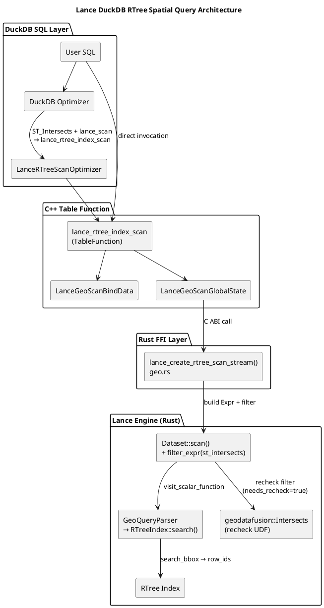
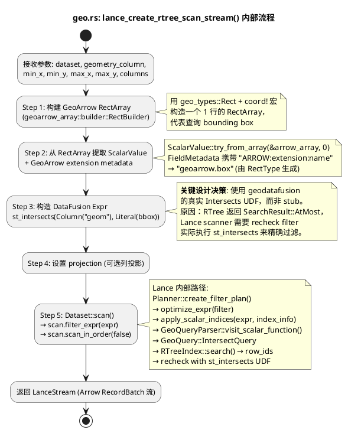
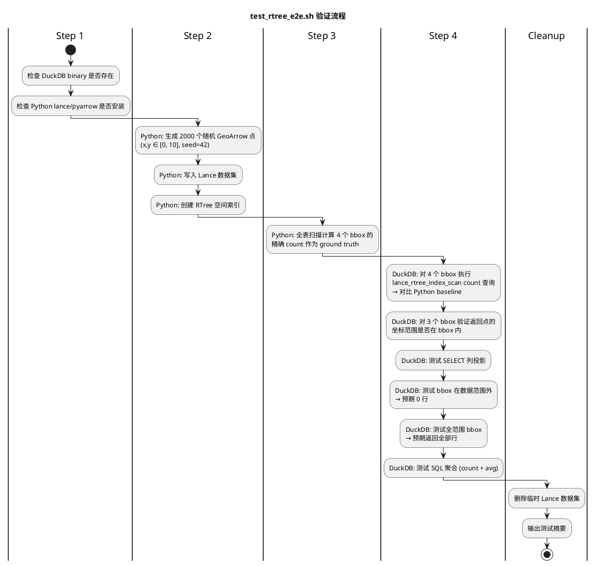

## Lance DuckDB RTree 空间索引查询

本文档总结 commit `3e53722aef4b555a7727ca60aa468e717dd27d98`（`demo: geo`）所做的修改和设计。

### 概述

该 commit 为 lance-duckdb 扩展新增了 **RTree 空间索引查询** 能力，允许用户通过 DuckDB SQL 对 Lance 数据集中带有 GeoArrow 空间列的数据执行高效的 bounding box 范围查询。

核心改动包括 **13 个文件，+1237 行**，涵盖：

| 层级 | 文件 | 说明 |
|------|------|------|
| Rust FFI | `rust/ffi/geo.rs` | 空间查询核心：构造 DataFusion Expr 并调用 Lance Scanner |
| Rust FFI | `rust/ffi/index.rs` | 新增 `RTREE` 索引类型支持 |
| Rust FFI | `rust/ffi/mod.rs` | 注册 `geo` 模块 |
| C++ | `src/lance_geo_scan.cpp` | TableFunction + OptimizerExtension 实现 |
| C++ | `src/include/lance_geo_scan.hpp` | Bind data 定义 |
| C++ | `src/include/lance_geo_types.hpp` | BBox 类型及空间谓词识别 |
| C++ | `src/include/lance_ffi.hpp` | FFI 接口声明 |
| C++ | `src/lance_extension.cpp` | 注册入口 |
| C++ | `src/lance_scan.cpp` | GeoArrow 类型识别钩子（no-op） |
| Build | `CMakeLists.txt` | 新增源文件和 Rust FFI 依赖 |
| Build | `Cargo.toml` / `Cargo.lock` | lance v2→v3 升级 + geo 相关依赖 |
| Test | `tests/test_rtree_e2e.sh` | 端到端验证脚本 |

### 整体架构



### 依赖升级

Lance 全线从 `v2.0.0-rc.4` 升级到 `v3.0.0-rc.1`，并启用 `geo` feature：

```toml
# 新增依赖
lance = { version = "3.0.0-rc.1", features = ["geo"] }
lance-index = { version = "3.0.0-rc.1", features = ["geo"] }
lance-geo = "3.0.0-rc.1"
geodatafusion = "0.2.0"
geo-types = "0.7.16"
geoarrow-array = "0.7"
geoarrow-schema = "0.7"
roaring = "0.11"   # from 0.10
```

### Rust FFI 层设计（`rust/ffi/geo.rs`）

#### 核心函数

`lance_create_rtree_scan_stream()` — 对外暴露的 C ABI 接口。

#### 执行流程



#### 关键设计决策：为什么使用真实 UDF 而非 Stub

RTree 索引的 `search_bbox()` 返回 `SearchResult::AtMost`（可能包含 false positives），Lance scanner 会在索引查询后执行 **recheck filter**：

```
post_take_filter = index_expr.to_expr()  // 将 GeoQuery 转回 st_intersects Expr
plan = LanceFilterExec::try_new(optimized_filter, plan)  // 实际执行 UDF
```

如果使用 stub UDF（只 panic "should be handled by RTree index"），recheck 阶段会失败。因此必须使用 `geodatafusion::udf::geo::relationships::Intersects` 真实实现。

### C++ 层设计（`src/lance_geo_scan.cpp`）

该文件实现两个核心组件：

#### 组件 1：`lance_rtree_index_scan` TableFunction

用户可直接调用的表函数：

```sql
SELECT * FROM lance_rtree_index_scan(
    '/path/to/dataset.lance',  -- Lance dataset URI
    'geom',                     -- geometry column name
    1.0, 2.0, 3.0, 4.0         -- xmin, ymin, xmax, ymax
);
```

**执行模型**：

| 阶段 | 函数 | 职责 |
|------|------|------|
| Bind | `LanceGeoScanBind` | 解析参数，打开 dataset 获取 Arrow schema |
| InitGlobal | `LanceGeoScanInitGlobal` | 打开 dataset，调用 FFI `lance_create_rtree_scan_stream` |
| InitLocal | `LanceGeoScanInitLocal` | 创建 ArrowArrayWrapper 缓冲区 |
| Execute | `LanceGeoScanExecute` | 逐 batch 读取 Arrow stream → 转换为 DuckDB DataChunk |

#### 组件 2：`LanceRTreeScanOptimizer` OptimizerExtension

自动重写优化器，将 DuckDB 查询计划中的空间谓词 + Lance 扫描模式自动下推为 RTree 索引扫描：

```plantuml
@startuml
title LanceRTreeScanOptimizer: Plan Rewrite

left to right direction

rectangle "Before" {
  (LogicalFilter) as F1
  (ST_Intersects\ngeom, ST_MakeEnvelope(...)) as PRED
  (LogicalGet\nlance_scan) as GET1

  F1 --> PRED
  F1 --> GET1
}

rectangle "After" {
  (LogicalGet\nlance_rtree_index_scan\nLanceGeoScanBindData) as GET2
}

F1 ..> GET2 : "optimizer\nrewrites"

@enduml
```

**匹配条件**（全部满足才触发重写）：

1. `LogicalFilter` 的子节点是 `LogicalGet`
2. `LogicalGet` 的函数名是 `lance_scan` / `__lance_table_scan` / `__lance_namespace_scan`
3. Filter 表达式中包含空间谓词（`ST_Intersects` / `ST_Within` / `ST_Contains` 等）
4. 空间谓词的参数之一是列引用、另一个是 `ST_MakeEnvelope(xmin, ymin, xmax, ymax)`
5. Lance dataset 在该列上存在 RTree 索引（通过 `lance_dataset_list_indices` 验证）

**支持的空间谓词**（定义在 `lance_geo_types.hpp`）：

- `ST_Intersects`
- `ST_Within`
- `ST_Contains`
- `ST_Covers`
- `ST_CoveredBy`
- `ST_Touches`
- `ST_Crosses`
- `ST_Overlaps`

### 其他修改

#### `rust/ffi/index.rs`

新增 `RTREE` / `R_TREE` 索引类型映射到 `IndexType::RTree`，使 DuckDB 可以通过 `lance_create_index()` 创建 RTree 索引。

#### `src/lance_scan.cpp`

在所有 scan bind 路径中插入 `TryResolveGeoArrowTypes()` 调用（当前为 no-op）。这是为 GeoArrow 列类型自动映射到 DuckDB `GEOMETRY` 类型预留的扩展点：

```cpp
// TODO(geo): Currently disabled because changing types without updating the
// ArrowTableSchema ArrowType causes ArrowToDuckDB to crash.
// To fully enable this, either:
//   a) Register a custom ArrowTypeExtension with cast callback, or
//   b) Convert GeoArrow STRUCT data to WKB in the Rust FFI layer.
static void TryResolveGeoArrowTypes(ClientContext &, const ArrowSchema &,
                                    vector<LogicalType> &) {
  // no-op for now
}
```

### 端到端验证脚本

#### 脚本路径

`tests/test_rtree_e2e.sh`

#### 前置条件

- 已编译的 DuckDB binary（debug 或 release build）
- Python 3 + `pylance` + `pyarrow` 包

#### 用法

```bash
# 使用默认路径 (build/debug/duckdb)
bash tests/test_rtree_e2e.sh

# 指定 DuckDB binary 路径
bash tests/test_rtree_e2e.sh build/release/duckdb

# 或者指定任意路径
bash tests/test_rtree_e2e.sh /path/to/duckdb
```

#### 验证流程



#### 测试项清单

| # | 类别 | 测试项 | 说明 |
|---|------|--------|------|
| 1 | 前置检查 | Prerequisites | DuckDB binary + Python packages |
| 2 | 数据生成 | Dataset + Index | 2000 行 Lance dataset + RTree index |
| 3 | 基准计算 | Ground truth | Python 全表扫描 4 个 bbox 的 count |
| 4-7 | 计数正确性 | Count × 4 bbox | DuckDB count 与 Python baseline 对比 |
| 8-10 | 空间正确性 | Bounds check × 3 bbox | 验证所有返回点坐标在 bbox 范围内 |
| 11-12 | 列投影 | Column projection | SELECT 子集列 + 列数验证 |
| 13 | 边界: 空结果 | Empty result | bbox(100,100,200,200) → 0 行 |
| 14 | 边界: 全范围 | Full range | bbox(0,0,10,10) → 2000 行 |
| 15 | SQL 聚合 | Aggregation | count(*) + avg(id) |

#### 示例输出

```text
============================================================
  Lance RTree Spatial Index - End-to-End Validation
============================================================

[INFO] DuckDB binary: build/debug/duckdb
[INFO] Test dataset:  /tmp/lance_rtree_e2e_test_12345.lance
[INFO] Num rows:      2000
[INFO] Seed:          42

[PASS] Prerequisites check
[PASS] Test dataset generated with RTree index
[PASS] Ground truth computed
[PASS] Count bbox(1.0,2.0,3.0,4.0): got 76 (expected 76)
[PASS] Count bbox(0.0,0.0,0.5,0.5): got 8 (expected 8)
[PASS] Count bbox(5.0,5.0,10.0,10.0): got 519 (expected 519)
[PASS] Count bbox(0.0,0.0,10.0,10.0): got 2000 (expected 2000)
[PASS] Bounds check bbox(1.0,2.0,3.0,4.0): all 76 points within bounds
[PASS] Bounds check bbox(0.0,0.0,0.5,0.5): all 8 points within bounds
[PASS] Bounds check bbox(5.0,5.0,10.0,10.0): all 519 points within bounds
[PASS] Column projection (SELECT id, name) returned data
[PASS] Column projection returns exactly 2 columns
[PASS] Empty result: bbox(100,100,200,200) returned 0 rows
[PASS] Full-range bbox: returned all 2000 rows
[PASS] SQL aggregation (count, avg) on spatial results works

============================================================
  Results: 15 passed, 0 failed, 15 total
============================================================
```

### 已知限制和 TODO

1. **GeoArrow → GEOMETRY 类型映射**：`TryResolveGeoArrowTypes()` 当前为 no-op，GeoArrow 列在 DuckDB 中显示为 `STRUCT` 而非 `GEOMETRY`。需要注册 ArrowTypeExtension 或在 FFI 层转换为 WKB。
2. **Optimizer 仅匹配 `ST_MakeEnvelope`**：当前 `LanceRTreeScanOptimizer` 只能从 `ST_MakeEnvelope(xmin,ymin,xmax,ymax)` 提取 bbox，不支持其他几何构造函数（如 `ST_GeomFromText`）。
3. **RTree Recheck 开销**：由于 Lance RTree 返回 `SearchResult::AtMost`，每次查询都会执行 `geodatafusion::Intersects` recheck。对于 bbox 查询，recheck 理论上是冗余的（点在 bbox 内 ⟺ 点在 bbox 的 MBR 内），但 Lance 目前没有 API 跳过 recheck。
4. **单线程执行**：`LanceGeoScanGlobalState::MaxThreads()` 返回 1，空间查询目前为单线程执行。
